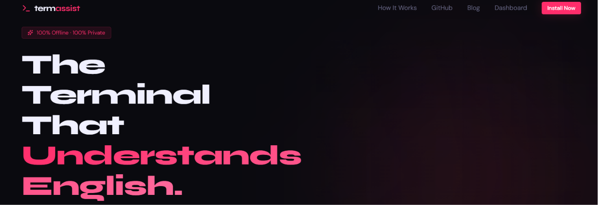
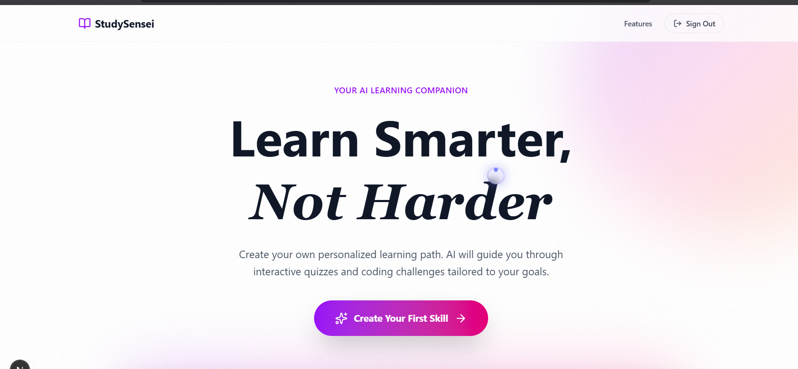
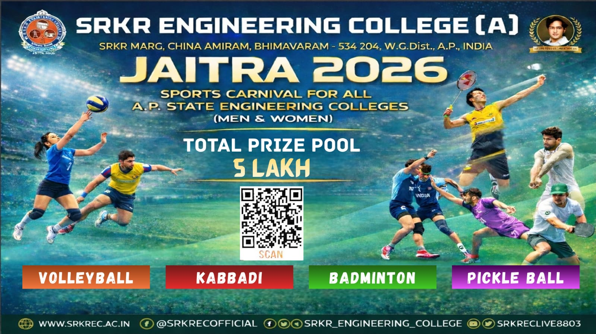
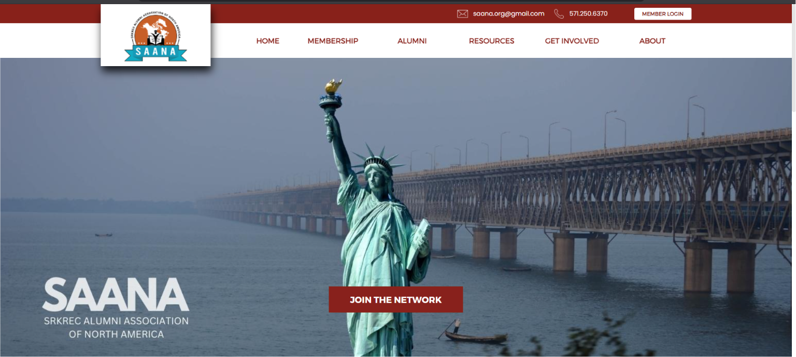

# <div align="center">

<!-- Hero Banner / Header -->


<p align="center">
  <a href="https://git.io/typing-svg">
    
  </a>
</p>

<!-- Social & Contact Badges -->
<p align="center">
  <a href="https://www.linkedin.com/in/manoj-kumar-gaddam-242302329" target="_blank">
    
  </a>
  <a href="https://github.com/Manoj-ruler" target="_blank">
    
  </a>
  <a href="mailto:manojgaddam133@gmail.com">
    
  </a>
  <a href="https://www.thesaana.org/" target="_blank">
    
  </a>
  <a href="tel:+918247075898">
    
  </a>
</p>

<!-- Quick Navigation Bar -->
<p align="center">
  <b>
    <a href="#-about-me">About Me</a> •
    <a href="#-tech-stack--tooling">Tech Stack</a> •
    <a href="#-featured-projects">Projects</a> •
    <a href="#-experience--milestones">Experience</a> •
    <a href="#-github-metrics--analytics">GitHub Stats</a> •
    <a href="#-get-in-touch">Contact</a>
  </b>
</p>

---

</div>

## 🌟 Executive Summary

```yaml
Name: Gaddam Manoj Kumar
Current Role: Software Development Engineer Intern @ Zennith AI
Education: B.Tech in Computer Science & Design @ SRKR Engineering College
Focus Areas: Full-Stack Engineering, AI & RAG Architectures, Voice Automation
Availability: Open for Full-Time & High-Impact Engineering Roles
Location: Andhra Pradesh, India 🇮🇳
```

> *"Passionate Full-Stack Developer & AI Systems builder focused on creating scalable web applications, real-time architectures, intelligent retrieval systems, and intuitive user experiences."*

---

## 👨‍💻 About Me

<table>
  <tr>
    <td width="65%" valign="top">
      <h3>Hey there! I'm Manoj 👋</h3>
      <p>
        I'm a final-year <b>Computer Science & Design</b> undergraduate and active <b>SDE Intern at Zennith AI</b>. With hands-on experience spanning end-to-end full-stack architectures and Generative AI workflows, I enjoy tackling challenging engineering problems and turning ideas into production-ready software.
      </p>
      <ul>
        <li>💼 <b>Currently working on:</b> Voice automation systems, agentic workflows, and high-performance full-stack applications at Zennith AI.</li>
        <li>🧠 <b>Deep Diving Into:</b> Vector search pipelines (pgvector), RAG architectures with LangChain, and low-latency CLI tools.</li>
        <li>🏆 <b>Achievements:</b> Winner of the <i>Webtech Hackathon 2024</i> & Team Lead for <i>Smart India Hackathon (SIH) 2024</i>.</li>
        <li>🌱 <b>Philosophy:</b> Clean code, robust API design, speed-of-light performance, and clean aesthetics.</li>
      </ul>
    </td>
    <td width="35%" align="center" valign="middle">
      
      <br/><br/>
      <a href="Manoj_Kumar_Gaddam.pdf">
        
      </a>
    </td>
  </tr>
</table>

---

## 🛠 Tech Stack & Tooling

<div align="center">

### 💻 Programming & Core Languages
<p>
  
  
  
  
  
  
  
  
</p>

### ⚛️ Frontend Frameworks & UI Architecture
<p>
  
  
  
  
  
  
</p>

### ⚙️ Backend, Microservices & APIs
<p>
  
  
  
  
  
</p>

### 🧠 AI Engineering & Intelligent Automations
<p>
  
  
  
  
  
  
  
</p>

### 🗄️ Databases & Vector Engines
<p>
  
  
  
  
  
</p>

### 🚀 Cloud, DevOps & Developer Tooling
<p>
  
  
  
  
  
  
  
  
</p>

</div>

---

## 🚀 Featured Projects

<table width="100%">
  <!-- Project 1: TermAssist -->
  <tr>
    <td width="50%" valign="top">
      <h3 align="center">⚡ TermAssist</h3>
      <p align="center"><b>Privacy-First AI Terminal Assistant & CLI Ecosystem</b></p>
      
      <br/><br/>
      <ul>
        <li>Natural language to executable bash translation with <b>sub-50ms offline retrieval</b> using BM25.</li>
        <li>Full-stack ecosystem consisting of a CLI tool and a centralized web dashboard.</li>
        <li>Secure token-based sync with Supabase and custom snippet management.</li>
      </ul>
      <p><b>Tech:</b> <code>Next.js</code> • <code>TypeScript</code> • <code>Node.js</code> • <code>Supabase</code> • <code>PostgreSQL</code> • <code>BM25</code></p>
      <p align="center">
        <a href="https://termassist.vercel.app/">
          
        </a>
        <a href="https://github.com/Manoj-ruler">
          
        </a>
      </p>
    </td>
    <!-- Project 2: StudySensei -->
    <td width="50%" valign="top">
      <h3 align="center">🧠 StudySensei</h3>
      <p align="center"><b>AI-Powered Personalized Learning & Mentorship Platform</b></p>
      
      <br/><br/>
      <ul>
        <li>RAG-powered document-based learning with <b>LangChain</b> and <b>pgvector</b>.</li>
        <li>Interactive coding challenges with live code evaluation and sandbox integration.</li>
        <li>Personalized dynamic roadmaps generated with <b>Google Gemini</b>.</li>
      </ul>
      <p><b>Tech:</b> <code>Next.js</code> • <code>TypeScript</code> • <code>LangChain</code> • <code>pgvector</code> • <code>Google Gemini</code> • <code>Supabase</code></p>
      <p align="center">
        <a href="https://github.com/Manoj-ruler/study_sensei">
          
        </a>
      </p>
    </td>
  </tr>

  <!-- Project 3: JAITRA 2026 -->
  <tr>
    <td width="50%" valign="top">
      <h3 align="center">🏆 JAITRA 2026</h3>
      <p align="center"><b>AP's Premier Engineering Sports Carnival Portal</b></p>
      
      <br/><br/>
      <ul>
        <li>Engineered live sports scoring system serving <b>6,190+ concurrent visitors</b> during the fest.</li>
        <li>Real-time score updates across 4 sports (100+ total tournament fixtures).</li>
        <li>Protected admin dashboard for scorekeepers and instant match announcements.</li>
      </ul>
      <p><b>Tech:</b> <code>PHP</code> • <code>JavaScript</code> • <code>MySQL</code> • <code>Bootstrap</code> • <code>HTML5/CSS3</code></p>
      <p align="center">
        <a href="https://jaithra2026.in/">
          
        </a>
      </p>
    </td>
    <!-- Project 4: Alumni & Association Portals -->
    <td width="50%" valign="top">
      <h3 align="center">🌐 SAANA & IGNA Official Portals</h3>
      <p align="center"><b>High-Traffic Organization Portals & Content Systems</b></p>
      
      <br/><br/>
      <ul>
        <li><b>SAANA (North America Alumni):</b> Comprehensive member registry, events feed, and admin workflow portal.</li>
        <li><b>IGNA:</b> Modernized web platform for Indo-German Nachkontakt Association with dynamic event publishing.</li>
      </ul>
      <p><b>Tech:</b> <code>HTML5</code> • <code>CSS3</code> • <code>JavaScript</code> • <code>PHP</code> • <code>Bootstrap</code></p>
      <p align="center">
        <a href="https://www.thesaana.org/">
          
        </a>
        <a href="https://www.ignahyd.in/">
          
        </a>
      </p>
    </td>
  </tr>

  <!-- Project 5: Computer Vision Temple Run -->
  <tr>
    <td colspan="2" valign="top">
      <table width="100%">
        <tr>
          <td width="40%">
            
          </td>
          <td width="60%" valign="middle">
            <h3>🎮 Gesture-Controlled Temple Run Game</h3>
            <p>
              Built an intelligent computer vision controller that transforms real-time webcam gesture inputs (jumping, ducking, strafing) into keypress automations to play Temple Run hands-free.
            </p>
            <p><b>Tech:</b> <code>Python</code> • <code>OpenCV</code> • <code>MediaPipe</code> • <code>PyAutoGUI</code></p>
            <a href="https://github.com/Manoj-ruler/temple-run">
              
            </a>
          </td>
        </tr>
      </table>
    </td>
  </tr>
</table>

---

## 💼 Experience & Milestones

```
📍 September 2025 – Present
   🏢 Software Development Engineer Intern | Zennith AI
   ├── Developing voice automation agents and conversational intelligence systems.
   ├── Building robust backend services with FastAPI and Node.js.
   └── Integrating scalable RAG models and database optimizations.

📍 August 2024
   🏆 Winner | Webtech Hackathon 2024
   └── Organized by SRKREC CS&D & CSIT Departments for innovative web application engineering.

📍 2024
   🎯 Team Lead | Smart India Hackathon (SIH) 2024
   ├── Team Name: Kanyarasi
   └── Solution: Next-gen Disaster Management & Rapid Response Coordination Platform.

📍 Season 4
   🌟 Open Source Contributor | Social Summer of Code (SSOC)
   └── Active contributions to community-driven developer tooling and open-source web ecosystems.
```

---

## 🎓 Education

| Institution | Degree / Program | Timeline |
| :--- | :--- | :--- |
| **SRKR Engineering College** | B.Tech in Computer Science & Design | Nov 2023 – Present |
| **Narayana Junior College** | Intermediate (MPC) | Jun 2021 – Mar 2023 |
| **Bhashyam E.M High School** | Secondary School Certificate (SSC) | Jun 2020 – Mar 2021 |

---

## 📊 GitHub Metrics & Analytics

<div align="center">

<table border="0">
  <tr>
    <td align="center">
      
    </td>
    <td align="center">
      
    </td>
  </tr>
  <tr>
    <td colspan="2" align="center">
      
    </td>
  </tr>
</table>

</div>

---

## 💬 Get In Touch

<div align="center">

<h3>Let's build something extraordinary together!</h3>
<p>I'm always open to discussing new engineering opportunities, startup collaborations, or tech innovations.</p>

<p align="center">
  <a href="mailto:manojgaddam133@gmail.com">
    
  </a>
  <a href="https://www.linkedin.com/in/manoj-kumar-gaddam-242302329">
    
  </a>
  <a href="https://github.com/Manoj-ruler">
    
  </a>
</p>

<br/>

<!-- Footer Wave -->


<p align="center">
  <sub>Designed with precision & passion by <b>Gaddam Manoj Kumar</b> • © 2025 All Rights Reserved</sub>
</p>

</div>
